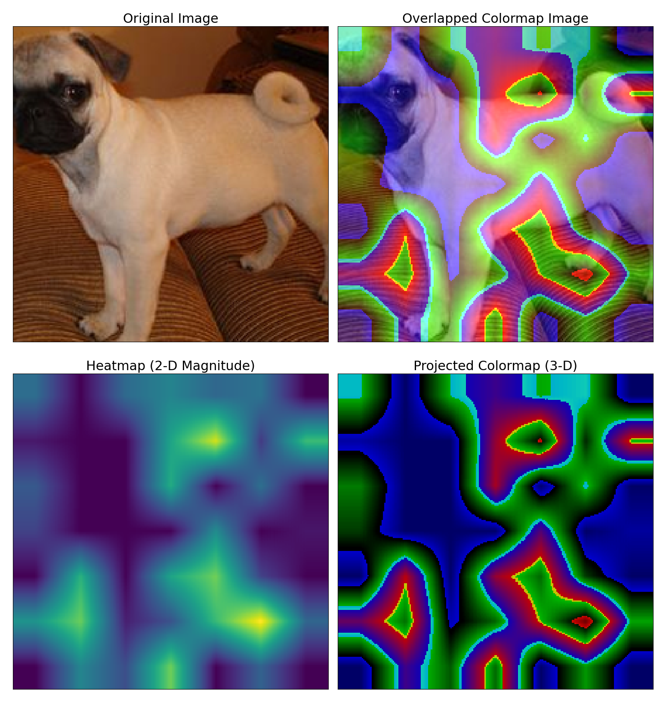

# GradCAM: Understand deep learning from high level and mathematical perspective

Implementation of [GradCAM](https://arxiv.org/pdf/1610.02391): Visualize the weight's gradient-activation with respect to the prediction the model makes. Currently supports CNN, ViT, and Swin Transformer from [timm](https://github.com/huggingface/pytorch-image-models). The visualization includes: heatmap, RGB channel injected heatmap, overlapped image, and an overview image.

<details>
<summary>How the visualization looks like (SwinT)</summary>


</details>

## Supported Model Types

| `model_type` | Description |
|---|---|
| `Normal` | Standard CNN-based models (ResNet, etc.) |
| `ViT` | Vision Transformer models |
| `DeiT` | vision transformer structured model with one extra distillation token embedding row |
| `SwinT` | Swin Transformer models |

## Installation

```bash
pip install torch torchvision timm matplotlib pillow numpy
```

## Usage

### Constructor Parameters

```python
GradCAM(
    model,                        # torch.nn.Module — the model to visualize
    layer_name,                  # str — full name of the name intended for GradCAM
    img_path=None,                # str — path to the input image
    img_value=None,               # tensor — pre-loaded image tensor (alternative to img_path)
    input_shape=(224, 224),       # tuple — image resize shape (used when no transform provided)
    model_type='Normal',          # str — 'Normal', 'ViT', or 'SwinT'
    transform=None,               # transforms.Compose — custom preprocessing (recommended for ViT/SwinT)
    verbose=False,                # bool — print debug info about shapes and predictions
)
```

### `__call__(heatmap_threshold=8)`

Runs the forward and backward pass to compute the Grad-CAM heatmap.

- `heatmap_threshold`: controls how much of the heatmap is shown. Must be > 1. Higher values suppress more low-activation regions (fewer highlights).

### `imposing_visualization(save_path=None, denormalize=None)`

Displays a 2×2 figure: original image, overlapped colormap, raw heatmap, and projected colormap.

- `save_path`: if provided, saves the figure and individual images (original, overlapped, heatmap, colormap) as PNGs.
- `denormalize`: tuple of `(mean, std)` lists to undo normalization before save the visualization images (e.g. for ImageNet-normalized inputs).

---

## Examples
### Get access to the layer names:

```python
from grad_cam_code.grad_cam import *
model = create_model('timm/resnet18.a1_in1k', pretrained=True)
model.eval()
print_layername(model)
```

### ResNet (CNN)

> **Note:** ResNet ends with an `AdaptiveAvgPool` before the classifier — use `layer4.1.conv2` instead of last layer of the backbone, or it will raise a dimension error.

> **Note:** It is important to implement `model.eval()` to make GradCAM success. This action will make the prediction stable and disable some training actions (e.g.: BatchNorm, Dropout).

```python
from grad_cam_code.grad_cam import *

model = create_model('timm/resnet18.a1_in1k', pretrained=True)
model.eval()

img_path = 'graphs/test_images/test2-pug-dog.png'

cam_vit = GradCAM(model,img_path, layer_name='layer4.1.conv2', model_type='Normal')
cam_vit(heatmap_threshold=20)
cam.imposing_visualization()
```

### Vision Transformer (ViT)

> **Just Note** ViT ends by taking only the [cls] patch of the backbone (encoder) into classfication header. 
```python
from grad_cam_code.grad_cam import *
from timm.data.transforms_factory import create_transform
from timm.data import resolve_data_config

model = create_model('vit_base_patch16_224', pretrained=True)
config = resolve_data_config({}, model=model)
transform = create_transform(**config)
model.eval()

img_path = 'graphs/test_images/test2-pug-dog.png'

cam_vit = GradCAM(model,img_path, layer_name='blocks.10.drop_path2', model_type='ViT', transform = transform, verbose=True)
cam_vit(heatmap_threshold=5)
cam.imposing_visualization()
```

### DeiT

```python
from grad_cam_code.grad_cam import *
from timm.data.transforms_factory import create_transform
from timm.data import resolve_data_config

model = create_model('timm/deit_small_distilled_patch16_224.fb_in1k', pretrained=True)
config = resolve_data_config({}, model=model)
transform = create_transform(**config)
model.eval()

img_path = 'graphs/test_images/test2-pug-dog.png'

cam = GradCAM(model,img_path,layer_name='blocks.10.drop_path2', model_type='DeiT', transform = transform,verbose=True)
cam(heatmap_threshold=8)
# Specify denormalize to undo ImageNet normalization when saving
cam.imposing_visualization(
    save_path="img/swt_test",
    denormalize=([0.4850, 0.4560, 0.4060], [0.2290, 0.2240, 0.2250])
)
```

### Swin Transformer

```python
from grad_cam_code.grad_cam import *
from timm.data.transforms_factory import create_transform
from timm.data import resolve_data_config

model = create_model('swin_base_patch4_window7_224', pretrained=True)
config = resolve_data_config({}, model=model)
transform = create_transform(**config)
model.eval()

img_path = 'graphs/test_images/test2-pug-dog.png'

cam = GradCAM(model,img_path,layer_name='layers.3.blocks.1.drop_path2', model_type='SwinT', transform = transform,verbose=True)
cam(heatmap_threshold=40)
# Specify denormalize to undo ImageNet normalization when saving
cam.imposing_visualization(
    save_path="img/swt_test",
    denormalize=([0.4850, 0.4560, 0.4060], [0.2290, 0.2240, 0.2250])
)
```

---

## How It Works

Grad-CAM computes a class-discriminative localization map by:

1. Running a forward pass through the model up to the target layer to get **activations** $A^k$.
2. Computing the gradient of the predicted class score $y^c$ with respect to those activations: $\frac{\partial y^c}{\partial A^k}$.
3. **Global average pooling** the gradients over the spatial dimensions to get per-channel weights $\alpha_k^c$.
4. Computing the weighted combination: $L^c_{\text{Grad-CAM}} = \text{ReLU}\left(\sum_k \alpha_k^c A^k\right)$.
5. Upsampling the resulting heatmap back to the original image size via bilinear interpolation and overlaying it using a jet colormap.

The `model_type` parameter controls how activations are reshaped:
- `Normal` (CNN-based): expects `(B, C, H, W)` feature maps (standard CNN conv outputs).
- `ViT/SwinT/DeiT` (transformer-based): reshapes the sequence dimension `(B, HW, C)` into a spatial grid `(B, H, W, C)`.

## Reference:
Theoretical support:
```
@article{Selvaraju_2019,
   title={Grad-CAM: Visual Explanations from Deep Networks via Gradient-Based Localization},
   volume={128},
   ISSN={1573-1405},
   url={http://dx.doi.org/10.1007/s11263-019-01228-7},
   DOI={10.1007/s11263-019-01228-7},
   number={2},
   journal={International Journal of Computer Vision},
   publisher={Springer Science and Business Media LLC},
   author={Selvaraju, Ramprasaath R. and Cogswell, Michael and Das, Abhishek and Vedantam, Ramakrishna and Parikh, Devi and Batra, Dhruv},
   year={2019},
   month=oct, pages={336–359} }
```

Part of the code implementation happened during my research on this paper:
```
@article{CHEN2024100332,
title = {A vision transformer machine learning model for COVID-19 diagnosis using chest X-ray images},
journal = {Healthcare Analytics},
volume = {5},
pages = {100332},
year = {2024},
issn = {2772-4425},
doi = {https://doi.org/10.1016/j.health.2024.100332},
url = {https://www.sciencedirect.com/science/article/pii/S2772442524000340},
author = {Tianyi Chen and Ian Philippi and Quoc Bao Phan and Linh Nguyen and Ngoc Thang Bui and Carlo daCunha and Tuy Tan Nguyen},
keywords = {Computer-aided diagnosis, Machine learning, Vision transformer, Efficient neural networks, COVID-19, Chest X-ray},
}
```

